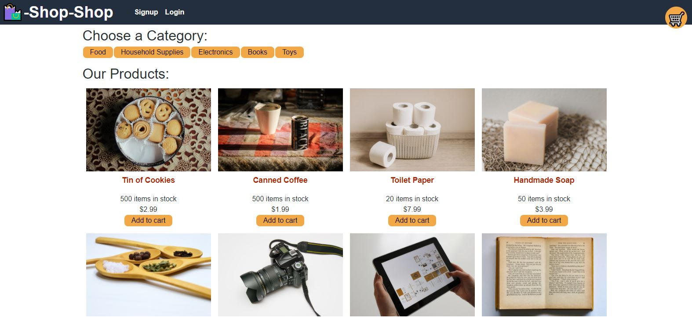

Garden Mart

Tracy Torisky

ttorisky@gmail.com

This platform uses Redux to manage global state.  The app uses a Redux store instead of a Context API.

The app uses a Redux provider, passing reducers to a Redux store instead of using the Context API.  

Users can register using the signup page and navigate to the products page.  

The user can then add and delete products from their cart.  

Finally, the user can check out by going to their shopping cart.
